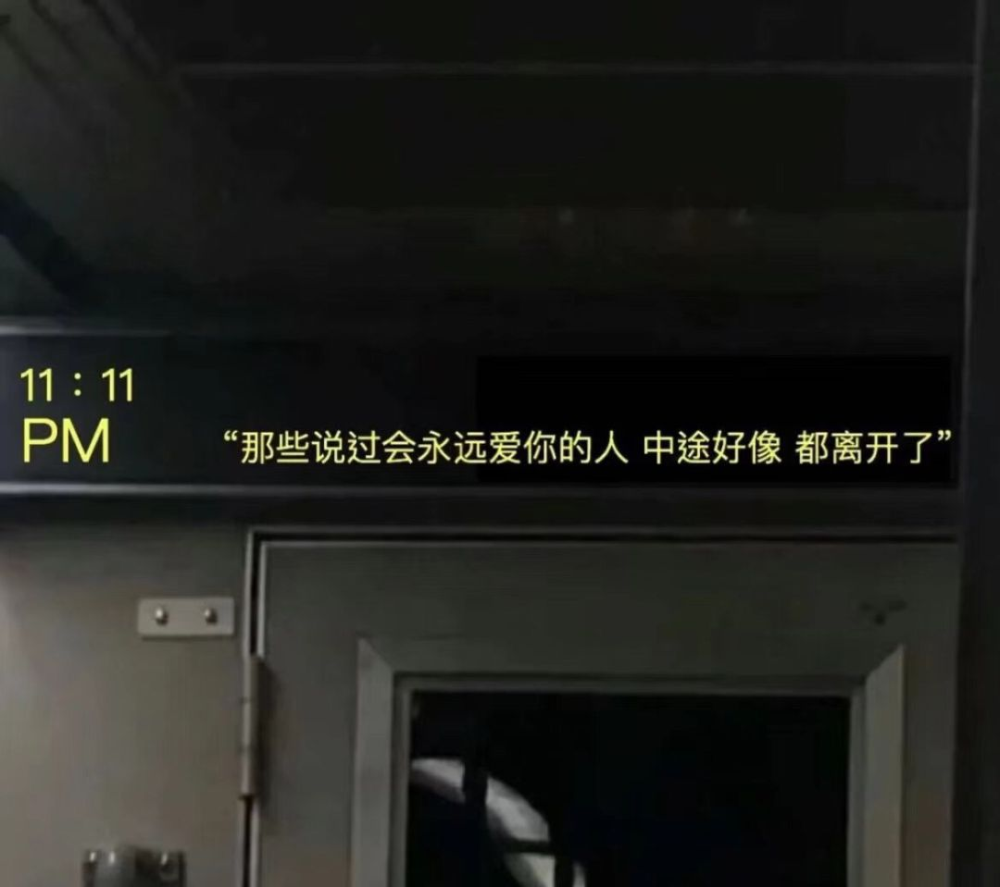

>2021-06-29

```
不争你这等念想，倘若其身有失，如何是了？
```

```
早餐店的老板问我要什么，我说我要肆意妄为 
要志德意满 遨游山川和湖海，我要这世间所有烂漫。
开个玩笑我已经长大 
我要一杯豆浆一份油条

老板说，收你一份勇敢，三分恬淡，
一生勇往直前，满腔热血未干。
他笑了笑，两块

老板娘说她有运筹帷幄，也有鸿鹄之志，
揽九天与海月，有人间四月天，
她微微笑着，三块五角钱。

```

```
有些人，有些事，
不仅失望，甚至绝望
生活，好像又回到了原点
你好，世界
```

```
小时候去过一次常州，父亲的一个朋友开车带我们去的，我记得那个时候过江是用摆渡船把汽车给运过去
刚来南京的时候我去过一次浦口，在中山码头坐的轮渡
所以当时的我理所当然的认为，如果汽车要过江，那肯定也是坐着船过去的
所以刚来南京的我认为，以后如果住在江浦，那进城肯定不方便
于是我就这样选择在江宁定居了

南京长江大桥一定认为我是个傻子吧

我也真希望我还是那个傻子

```
