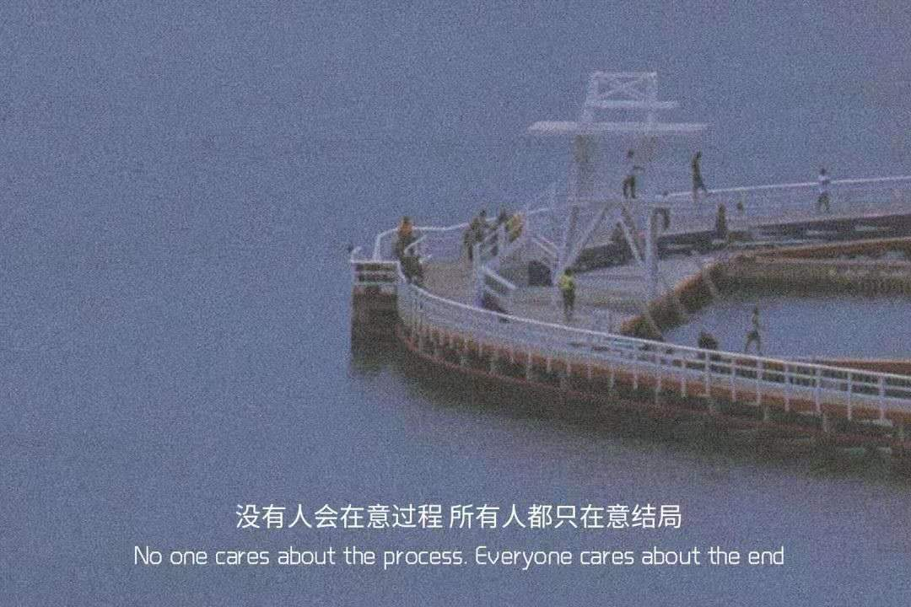

>2021-07-14
```
今天干了一个挺有意思的事情
在生产服务器上，执行了rm -rf *
不幸的是，执行的目录不是我以为的目录，而是当前用户的根目录
幸运的是，执行目录不是 / ，而且rm -rf * 不会删除 点号开头的隐藏文件
前者缩小了影响范围，后者保证了我所有的用户配置文件还在

好在删除的只有一个jdk，一个zookeeper，一个java应用
文件删除之后，进程都还在，所以生产的服务都还是在正常运行

短暂的惊慌失措之后，评估了下影响，还好还好，问题不大 
重新配置了jdk，重新配置了zk
重新上传了最新的jar包，改了配置文件
最后，再全部重启下进程。
几乎没有对线上造成什么影响

这次也算是幸运，但也要引以为戒
时刻对生产保持敬畏执行
避免甚至杜绝使用 rm -rf命令
删除文件之前要再三确认，并做好备份
```

```
40度的仲夏，也捂不热凉薄的人心
```

```
好累，今天不健身了
回去休息
明早过来跑个步
好久没去食堂吃早饭了
该去一次了
```
