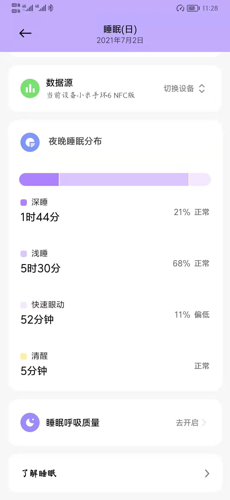
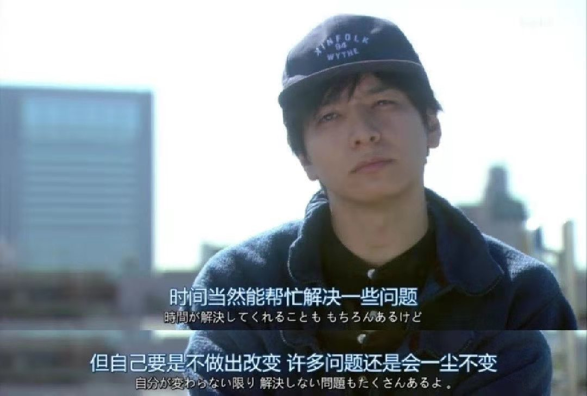

>2021-07-02

今天知道了什么叫做[快速眼动睡眠](https://baike.baidu.com/item/%E5%BF%AB%E9%80%9F%E7%9C%BC%E5%8A%A8%E7%9D%A1%E7%9C%A0%E6%9C%9F/6132543?fr=aladdin)
早上睡醒了总觉得没精神
还是睡得太晚了



```
早上没忍住买了袋酸奶和一袋饼干
好久没吃过闲趣饼干了
感觉没以前好吃了

中午下雨没去食堂，
吃了单位的泡面，真巧，刚好4桶泡面凑了一桌
蹭了同事的西瓜和蓝莓
还有领导贴心的面饼
有点撑

下午泡了杯黑咖啡，一不小心放多了，好苦

大学同学刚好在隔壁公司，
一起去喝了杯饮料，聊了一会
他想跳槽，钱多的加班多，加班少的工资给不起，想来想去还是现在的性价比高
果然，哪里都很卷

从楼下上来又赶上了每周五的雪糕日
这一天吃的，全是高热量食品
又要长肉了
```

```
工作原因，买了一个macbook
加上之前买的airpods，和ipad
本想今年买个苹果13 凑个全家桶的
但是吧
手上的mate 20 pro 才用了两年，各方面性能其实至少再用3年没啥问题
而且苹果手机不支持nfc复制，不支持手机红外，不支持40W以上的快充，不支持南京地铁卡
手机信号不如华为，左右滑动不如安卓方便
仅仅为了一个全家桶的生态
花大几千
真的值得吗
好像也并不值得
等13出来再看吧
```

```
明天喝酒
```

