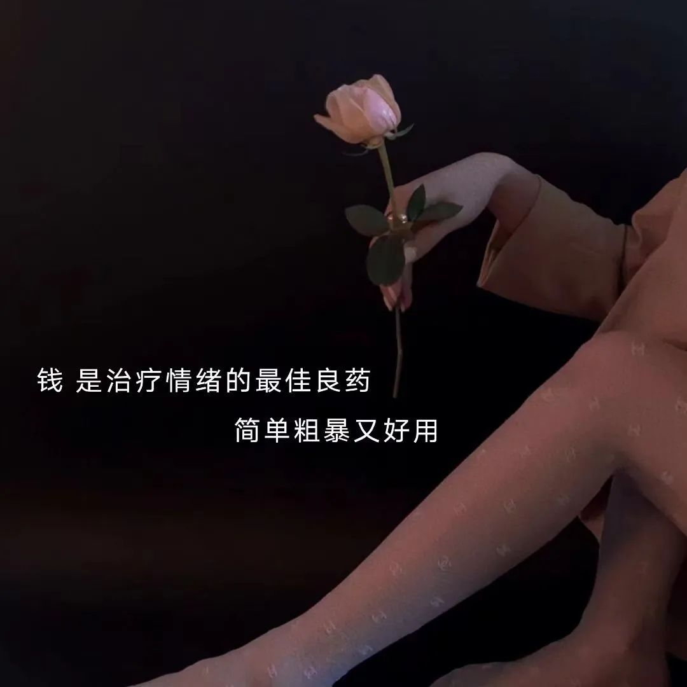

>2021-08-11
```
没啥事，就是像写点东西

今天 🐶
好困 🐶
好累 🐶
好像没啥事做，又好像好多事情都还没做🤕
又是没有暴富的一天😭
```

```
仔细想一想，我们这一生中，自己能够决定的很少。
我们决定不了 我们的出身，我们决定不了  我们的智商，
我们可能，能决定5%的东西，但95%的东西是我们决定不了的。
我们登上并非我们所选择的舞台，演出并非我们所选择的剧本，
在座的有谁的剧本，是你自己设定的。
其实不是的，有很多时候，我们会羡慕别人的剧本，我有时候也会很羡慕别人的剧本，
但是，没有谁的剧本值得羡慕，你只能把你自己的剧本演好，
有很多时候是不是觉得我们抓的牌，实在是太差了，
但再差的牌，你都应该打下去，有时候我们惊奇的发现，
再差的牌，有时候还赢了。
有没有这种可能，有时候你抓了一手好牌，觉得你会赢，
反而干嘛呢，反而输了，如果在你的一生中，正在遭遇这些挫折。
那对不起，这就是你的剧本，你有两种选择，一种选择是弃演，
还有一种选择，把它给演好，所以希望大家能够演好自己的剧本。

```

