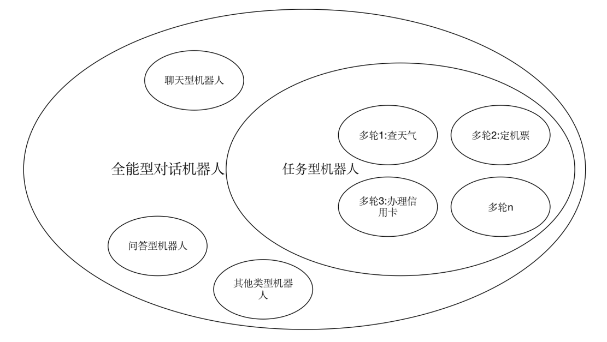
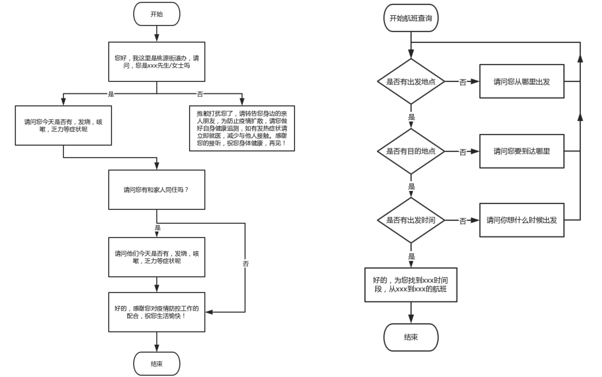
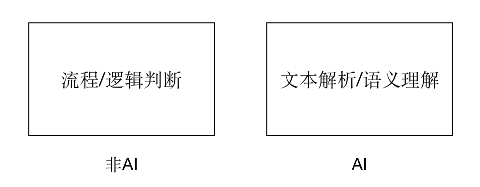
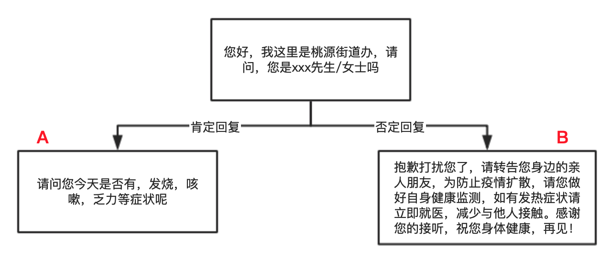

# 人机交互的三个阶段
- 用户和智能进行交互主要是通过鼠标以及触控来实现的，比如在电脑上玩游戏、手机上玩游戏。
- 用户和智能设备进行交互主要是通过语音的方式来进行交互，比如苹果手机或者小米手机通过唤醒siri以及小爱同学，就可以实现不用触碰手机就能放音乐、设置闹钟、给好友打电话等操作。
- 着重VR、AR以及追踪技术的发展，使用户在体验产品的时候可以更加直观、真实地体验产品，从而提高用户的使用感受，也可以用户的沉浸感。

# [做了20+个AI多轮对话项目后的总结](http://www.woshipm.com/ai/4386978.html)
## 一、什么是多轮对话
### 1.多轮对话的定义
定义：根据上下文内容，进行连续的，以达到解决某一类特定任务为目的的对话。

这里有3点：

- 上下文：机器人的每次出话，都是跟上文有强关联关系的；
- 连续性：一个完整的对话内可进行多次连续的对话交互；
- 某一类特定问题：这里主要是限定下讨论范围，讨论的是一个封闭域问题，一个完整的对话，只负责处理一个特定的任务。比如说订机票是一特定的任务；订外卖是一个特定的任务；查天气也是一个特定的任务。
  
### 2.多轮对话跟机器人的关系
多轮对话跟机器人的关系图：

通常来说，一个全能型的对话机器人是由很多个类型的机器人组成的，比如说闲聊机器人、任务机器人、问答机器人。而一个任务机器人内又可以包含多个多轮。

### 3.多轮对话和多轮对话平台的关系
那怎么来实现多轮对话呢？市面上各大厂家的做法是开发一个用于构建多轮对话的平台。有了这样的平台，你就可以构建出你想要的对话流程。

多轮比较擅长处理的两类经典任务：
- 分类任务（如上左图），用户的表达属于分支的哪一类，每一类应该走什么分支。
- 信息收集/查询类任务（如上右图），需要向用户收集哪些必要信息，如查航班，需要收集出发地、目的地、出发时间3个必要信息。

如果把多轮对话比作一辆汽车的话，那多轮对话平台就是一个组装车间，底层的各类AI工具，就相当于汽车的零部件，因此我们可以在对轮对话平台内，用各种的工具，来组装出你想要的对话逻辑。

这里你可能想说，这个哪里智能了，不就是我们实现定义好的流程吗？是的，**它确实并没有你想象中的那么智能，没有你想象中的那样通过大量的数据就能自己学习出一个流程，也没你想象中的那样机器可以自己生成新的答复话术。**

但是它确实能解决很多工业上的问题，特别是一些比较固定的流程，比如说：

- 电销，机器人询问用户是否感兴趣；这里机器人最重要的事情不是促成下单，而是筛选有意向的用户。比如说用户说感兴趣，甚至是跟机器人多聊几句，就会被标识为感兴趣，然后后面就会有人工客服来跟进了。
- 自助服务，传统的IVR是通过按键的形式来识别用户的意图的（充值服务请按1，业务办理请按2…..），那智能机器人可以直接识别并理解用户的自然语言来提供服务（如用户可以直接说：我要查询话费）。
- 满意度回访，机器人通过电话回访来收集用户对服务的满意度情况，是否满意、不满意原因是什么，有什么改进意见等等。
- 疫情期间人员基本情况调查，如收集用户是否有从武汉回来、有没有接触从武汉回来的人，有没有发烧、流鼻涕等信息。
  
这些固化的流程完全可以用机器人来完成，大大减少人力成本。相比于人，机器人可以一天24小时，同一时间多线路给多个人拨打电话。

## 二、多轮对话平台由哪些功能模块组成
### 1.按流程的执行顺序分
- **进入多轮对话任务的条件**
比如识别到有订票的意图，则进入到订机票的多轮对话任务中；也可以通过关键字、指令等方式进入到多轮对话任务中。

- **机器人的应答话术**
即用户的每一个动作（query），机器人应该用什么话术去应答。

**目前任务类型的对话通常话术都是预设的**，基本不会是生成式的。因为任务性对话容错率很低，宁可答不上，也不能答错。**生成式的应答话术，更多是在闲聊机器人中，因为闲聊容错率相对比较高**。

- **流程流转条件的设置（if）**
- **满足条件执行动作的设置（then）**
条件设置和动作设置是整个流程的核心思想，整个对话流程都是按：如果条件是什么…那么执行什么动作…的格式设置。
- **退出多轮对话任务的条件**
最后，这个对话肯定是不能永远继续下去的，需要设置结束对话的条件，比如说常见的有以下几种情况：

1. 任务已经完成结束，比如说已经收集完需要收集的信息；
2. 用户主动要求转人工结束，比如说用户跟机器人聊不下去了，要求要人工服务；
3. 用户长时间未回复结束，比如说机器人出话后，用户10分钟内没有响应就自动结束。
   
### **2.按流程设置和文本解析（语义理解）分**
- 按另外一个维度，可以把多轮对话分为流程设置和文本解析（语义理解）。

***流程设置–设定对话的流转逻辑，如是什么，那就做什么**
（如下图，如果是肯定回复那就跳转到A节点，如果是否定回复就跳转到B节点）这一块逻辑判断跟AI没有什么关系。

***文本解析（语义理解）–理解用户说的话是什么***
（如上图，如果用户说“我是他妈妈”，机器人怎么知道这是属于否定回复，这就是文本解析要做的事情），也是整个多轮对话的核心。

文本解析工具主要分类两大类：信息收集、文本分类。

***1）信息收集***
收集信息的方式主要有两种：对话里收集、对话外收集。

- 对话里收集：用各种解析器在对话内容中解析出所需信息，比如说时间解析器收集时间、地址解析器收集地址、电话号码解析器收集电话号码等。
- 对话外收集，即不是通过对话内容来收集的，而是通过其他数据交互方式获取的，比如说通过手机定位，来获取用户的位置信息；通过账号，来获取用户的基本信息等等。

***2)文本分类***
对话中的文本分类，通常又分为两大类：有较完整的句子结构类文本、超短文本。

- 有句子结构类文本（someone want to do something）描述了一个比较完整的意图。有主谓宾这样的句子结构。比如说意图、FAQ，就是有句子结构的文本类型。
- 超短文本，没有句子结构的，比如说；好的、可以、ok、行。常见的处理这类型超短文本的解析工具有：语言分类器、选择解析器。

除了是否有句子结构外，两类型的文本分类解析工具的应用场景也不一样。有句子结构类文本解析工具，是全局的应用。比如说“我要转人工服务”，可以做出一个意图，不管在流程的哪个节点，用户表达了这样的意图，都可以识别。

超短文本类解析工具，是局部应用的，是强依赖上线文的。比如说用户单独说一句“不是的”，如果没有上下文，是没有意义的。

机器问“请问您是深户吗”，用户可以回复“不是的”；

机器问“请问您是深圳高校学生吗”，用户可以回答“不是的”；

因此同样“不是的”，在不同的地方表达的意思是不一样的，只有联系上文，才能确定明确的含义。

解析工具直接决定了多轮对话平台能力的上限，而决定解析工具能力又可以分为两层：基础技术层、产品层。

- 基础技术层：取决于NLP的能力，包括分词、词性标注、NER识别、词法分析、句法分析、情感分析、句子相似度等底层的能力。
- 产品层：有了强大的NLP能力，那能不能把这些技术落地，包装成实际的解决方案，去解决实际的场景问题，就是考验底层技术产品化的能力了。
  
## 三 、多轮对话平台目前的存在的问题
### 解析工具与场景的不默契
***1）例子1***
- 用户：帮我订一张机票
- 机器人：好的，请问你要从哪里出发呢
- 用户：深圳明天会下雨吗

问在哪里出发后，我们往往会调用一个地址解析器来解用户接下来说的话，用户回复“深圳明天会下雨吗”，这时会抽到地址【深圳】，那机器人就理解为出发地是【深圳】了。

解析器确实没有问题，解出了地址【深圳】，但是解出的地址是不是符合上文需要填充的槽位，这时机器人就无能为力了，因为解析器只管解析，不管业务。

***2）例子2***
- 用户：帮我查询电费
- 机器人：请问你要查几月份的呢
- 用户：8
问是几月份，我们往往会在这个时候调用一个时间解析器来解用户接着说的话，用户只回复“8”，这时时间解析器解不出结果，因为时间解析器只能解“8月”、“8号”等等这个带单位的时间。纯说一个数字，机器人就懵掉了。

从上面两个例子就可以看出，解析工具跟实际应用场景的隔阂，导致了运用起来不够灵活，主要矛盾点体现在：

- 如果解析工具跟场景分割开，就会出现以上的问题；
- 如果解析工具跟场景紧密关联，那通用性就比较差，这样会导致这个解析工具仅适用于某个场景，而无法迁移到其他场景。

### 解析工具与解析工具之间不默契
举例：
- 用户：帮我订一张机票
- 机器人：好的，请问你要从哪里出发呢
- 用户：深圳明天会下雨吗
  
还是以上面例子为例，首先来了解几个概念：
- 主流程与辅助问答：这个多轮的主流程就是收集订机票所需要的槽位，辅助问答是只在主流程的过程中用户可能会问些相关的问题，如“怎么退票”、“深圳明天天气怎么样”。机器人回答完辅助问答之后，会继续回答主流程，继续收集槽位信息。
- 信心分：是指解析工具，匹配到结果的分数值。假设分数值是从（0–100），假设信心分高于80分机器人就采纳。
- 中控优先级：是指取解析工具结果的优先顺序，比如说解析工具A的优先级大于解析工具B，那解析工具A和B解析结果的信息分都是90分，那机器人会优先取A的结果。
  
ok，了解了上面的概念之后，我们再回过来看这个例子。

用户说了：深圳明天会下雨吗？

会有两个解析工具解到结果，假设地址解析工具得到的信心分是90分，意图解析工具解到的【查天气】意图的信心分也是90，但是由于地址解析工具属于主流程，优先级高于查天气意图，因此机器人最后选择的是前者。因此机器人的动作是把【深圳】当作了出发地填入槽位。

***因此，从这里可以看到有两个问题：***
1. 人为事先设定的死死的规则，是没办法应对在自然对话中无穷无尽的场景。因此机器人的决策机制不能全由预设规则决定，应该是要结合实际的数据，比如说可以针对单个节点做训练，A类数据出A回复；B类数据出B回复。
2. 解析工具与工具之间没有建立连接，它们之间各自评分，相互之间没有通讯，没有协作关系。如果解析工具之间先经过讨论，再给出结果，是不是会有更好的效果呢，就比如说，识别到查天气的意图之后，意图工具会告诉地址解析工具，这里的【深圳】是只深圳的天气，可能不是你想要的出发地，你要再考虑下。这只是一个脑洞，但值得我们去深思。

### 机器人的回复话术是非生成式的
这里先理清一对概念：

- 预设式话术：话术提前设定，不会改变
- 生成式话术：机器人根据场景的各变化因素，而创造出的话术
举例：
- 机器人问题1：请问你平均每天运动有超过30分钟吗？
- 用户：我平均每天至少跑步1小时
- 机器人问题2：请问你会经常熬夜吗？

机器人的话术已经被事先死死的设定了，问完问题1，就问问题2。没有根据用户的话做出一些反馈，就会显得很生硬。

假设能这样：
- 机器人问题1：请问你平均每天运动有超过30分钟吗？
- 用户：我平均每天至少跑步1小时
- 机器人问题2：那你很自律啊，这么说你应该不会经常熬夜吧？

这样不但能对用户的回答做出响应，还根据用户前面说的话来调整问题2的问法。这就是非生成式回答无法达到的效果，这也是机器人比较死板的原因。

### NLP理解的维度比较局限
举例:

还记得她吗，在采访中她说“我已经用了洪荒之力了”。如果你只看文字，你能理解她里面所表达的是满意的情绪吗？

正常人与人的对话，一般会根据语调、文字、表情、动作等维度，组合起来理解对话所表达的内容。但是目前大多数的多轮对话平台都是只以【文字】单一维度来做解析处理，即使很多平台都亮出了自己在ASR环节的情绪理解有多么强大，但真正跟多轮平台运用起来是隔离开的，训练数据只是转译成文本的形式训练，而不是直接拿语音去训练。

不同语气的“呵呵”，表达的意思是不一样，有的是开心，有的是讽刺。如果丢失了语调的维度，那解析的结果肯定是会失真的。

### 使用门槛高，优化难度大
在以用户体验为王的时代，如果你操作一个软件或APP，你还要看它的说明书，甚至看了说明书还不会操作，那你肯定会疯掉。

没错，多轮对话操作平台就是一个看了说明说还不会用平台，通常需要经常专业的培训才会使用，因此是有很高的使用门槛的，而且逻辑能力不好人，还真做不来。

除了操作门槛高，后续的优化也不灵活。不是说像我们想象中的那么简单，加点数据，标注下就能解决的。比如说机器人询问：你是马先生吗？

你一开始想到的用户可能的回答是两类：肯定回复（是的、我是）、否定回复（不是、打错了）。但是上线后，你会发现还有很多类型的回复：中性回复【怎么啦、你说】、式有关系人【我是他老婆、我是他儿子】、反问【你是谁呀、是机器人吧你】

***每增加一个分类，就要重新在流程图里增加分支，从新设定规则等等，并非直接加点数据重新训练就能解决问题了。***

## 四. 多轮对话平台未来的发展方向是怎样的
### 1.在目前的框架下去优化
前面大篇幅讨论了，目前多轮对话平台的核心是解析工具，因此我觉得未来的优化方向也是在解析工具上面，比如说：

- 怎么让解析工具通用，然后又可以跟特定的场景紧密结合在一起；
- 怎么让解析工具之间的协作更加高效，更加合理；
- 怎么让后期优化延伸性更加广，让机器有条不紊的接纳更多的分类。
### 2. 用新的框架去解决问题

目前的做法是对话流程、对话分支是由人工搭建的，这种方式对数据的利用率是非常低的。只是根据对话记录，人为整理出对话流程，而对话之间的上下文关系是不参与到模型训练的。***机器人不会随着人机对话量的增加而变得更加聪明。***

未来的优化方向一定是最大化的利用数据，比如说通过给机器输入大量的对话记录，机器能够学习出对话之间的逻辑关系，然后自己能学习出一个对话流程。

最后，用一句话总结下目前的多轮对话平台：在解决固定化流程的问题上，确实能降低人力成本，但是对话比较死板，要想做到向人与人之间的自然交流，还有很长的路要走。

