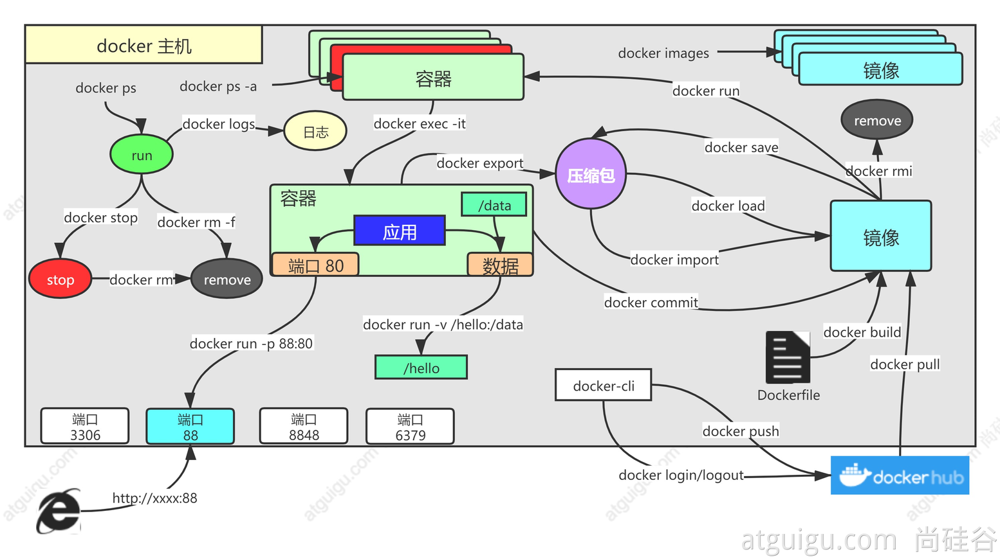

# Docker
## [docker 安装](https://docs.docker.com/engine/install/centos/)
1. centos下安装docker
```
1、移除以前docker相关包
sudo yum remove docker \
                  docker-client \
                  docker-client-latest \
                  docker-common \
                  docker-latest \
                  docker-latest-logrotate \
                  docker-logrotate \
                  docker-engine
2、 配置yum源
sudo yum install -y yum-utils
sudo yum-config-manager \
--add-repo \
http://mirrors.aliyun.com/docker-ce/linux/centos/docker-ce.repo

3、安装docker
sudo yum install -y docker-ce docker-ce-cli containerd.io


#以下是在安装k8s的时候使用
yum install -y docker-ce-20.10.7 docker-ce-cli-20.10.7  containerd.io-1.4.6

4、启动
systemctl enable docker --now
```
## docker 常见命令

```
docker run [OPTIONS] IMAGE [COMMAND] [ARG...]

【docker run  设置项   镜像名  】 镜像启动运行的命令（镜像里面默认有的，一般不会写）

# -d：后台运行
# --restart=always: 开机自启
docker run --name=mynginx   -d  --restart=always -p  88:80   nginx


# 查看正在运行的容器
docker ps
# 查看所有
docker ps -a
# 删除停止的容器
docker rm  容器id/名字
docker rm -f mynginx   #强制删除正在运行中的

#停止容器
docker stop 容器id/名字
#再次启动
docker start 容器id/名字

#应用开机自启
docker update 容器id/名字 --restart=always

# 进入容器内部的系统，修改容器内容
docker exec -it 容器id  /bin/bash

# 挂载外部数据
docker run --name=mynginx   \
-d  --restart=always \
-p  88:80 -v /data/html:/usr/share/nginx/html:ro  \
nginx

# 修改页面只需要去 主机的 /data/html


#提交改变
docker commit [OPTIONS] CONTAINER [REPOSITORY[:TAG]]

docker commit -a "authorname"  -m "首页变化" 341d81f7504f test:v1.0

# 将镜像保存成压缩包
docker save -o abc.tar guignginx:v1.0

# 别的机器加载这个镜像
docker load -i abc.tar


# 镜像推送
docker tag local-image:tagname new-repo:tagname
docker push new-repo:tagname

# 把旧镜像的名字，改成仓库要求的新版名字
docker tag guignginx:v1.0 leifengyang/guignginx:v1.0

docker logs 容器名/id   排错

docker exec -it 容器id /bin/bash


# docker 经常修改nginx配置文件
docker run -d -p 80:80 \
-v /data/html:/usr/share/nginx/html:ro \
-v /data/conf/nginx.conf:/etc/nginx/nginx.conf \
--name mynginx-02 \
nginx


#把容器指定位置的东西复制出来 
docker cp 5eff66eec7e1:/etc/nginx/nginx.conf  /data/conf/nginx.conf
#把外面的内容复制到容器里面
docker cp  /data/conf/nginx.conf  5eff66eec7e1:/etc/nginx/nginx.conf

## 打包dockerfile
FROM openjdk:8-jdk-slim
LABEL maintainer=authorname

COPY target/*.jar   /app.jar

ENTRYPOINT ["java","-jar","/app.jar"]
-------------
docker build -t java-demo:v1.0 .
```

# Kubernetes基础概念

我们急需一个大规模容器编排系统

## kubernetes具有以下特性：
- 服务发现和负载均衡
Kubernetes 可以使用 DNS 名称或自己的 IP 地址公开容器，如果进入容器的流量很大， Kubernetes 可以负载均衡并分配网络流量，从而使部署稳定。
- 存储编排
Kubernetes 允许你自动挂载你选择的存储系统，例如本地存储、公共云提供商等。
- 自动部署和回滚
你可以使用 Kubernetes 描述已部署容器的所需状态，它可以以受控的速率将实际状态 更改为期望状态。例如，你可以自动化 Kubernetes 来为你的部署创建新容器， 删除现有容器并将它们的所有资源用于新容器。
- 自动完成装箱计算
Kubernetes 允许你指定每个容器所需 CPU 和内存（RAM）。 当容器指定了资源请求时，Kubernetes 可以做出更好的决策来管理容器的资源。
- 自我修复
Kubernetes 重新启动失败的容器、替换容器、杀死不响应用户定义的 运行状况检查的容器，并且在准备好服务之前不将其通告给客户端。
- 密钥与配置管理
Kubernetes 允许你存储和管理敏感信息，例如密码、OAuth 令牌和 ssh 密钥。 你可以在不重建容器镜像的情况下部署和更新密钥和应用程序配置，也无需在堆栈配置中暴露密钥。

Kubernetes 为你提供了一个可弹性运行分布式系统的框架。 Kubernetes 会满足你的扩展要求、故障转移、部署模式等。 例如，Kubernetes 可以轻松管理系统的 Canary 部署。

