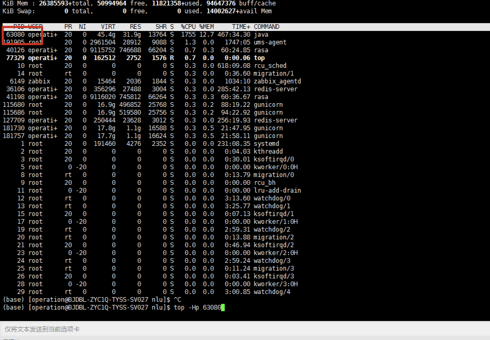
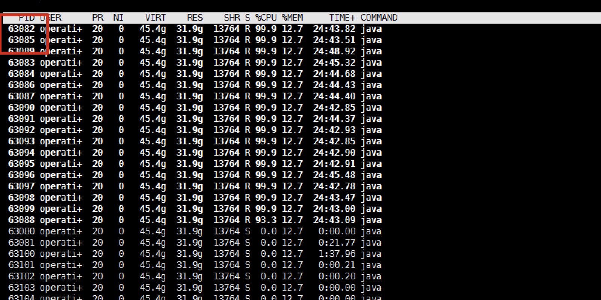
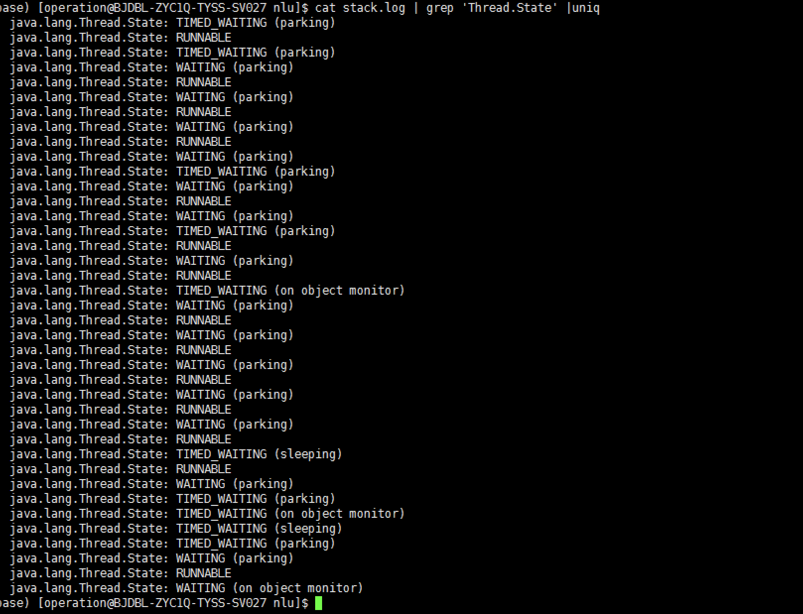
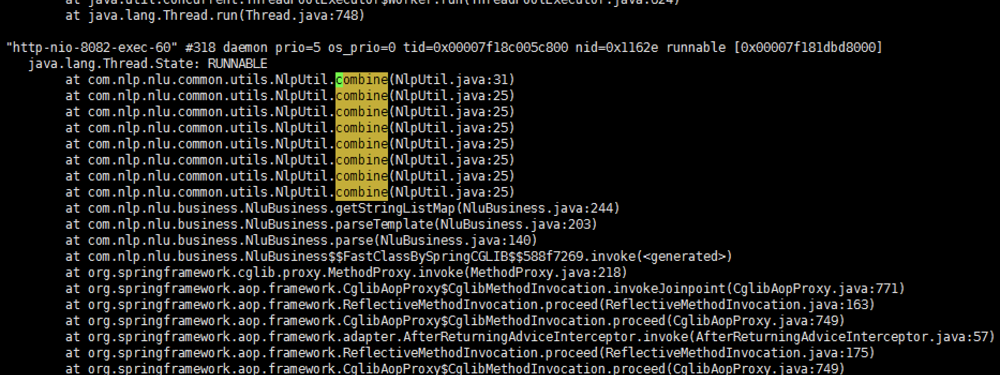

## 问题背景
新上线了一个java项目，发现经常有超时的响应，大概30%左右，上线之前也做过压测，也没有问题，这就有点麻烦了

## 问题发现
找了运维的同学，把超时的请求都找了出来，全部汇总之后拿回来分析，发现大部分是字符串比较长的请求导致的响应慢
再看看压测的数据，都是比较短的，那么不出意外，问题就出在这里了
让测试的同事换了线上出问题的数据重新压一遍，问题复现了，那就好办了。

## 问题现象
压测的时候发现，短文本数据请求能正常压没问题，长文本请求压测的，cpu使用率就开始飙升，一段时间之后，服务就没响应了
压测脚本停了之后，cpu还是居高不下。使用top命令可以查看到


## 问题定位
使用top -Hp +pid命令可以看到java线程id和占用的cpu状态，已经没有请求了，但是线程还在跑，且每个线程将单核cpu都占用到了99%
```
top -Hp 63080
```



此时使用 jstack命令可以输出当前的线程堆栈命令
```
jstack 63080 >jstack.log

```



可以看到的是，线程堆栈里面有各种不同状态的线程，既然是占用cpu还在跑的，那我们应该看的是RUNNABLE状态的，要怎么看呢
之前使用top -Hp命令我们得到了线程id的十进制数值，首先转换成16进制
```
printf "%x\n" 71214

```
结果是 1162e，那么在jstack.log里面查找 1162e关键字



看到这里我就明白了，这个方法的入参是一个list，返回是这个list中数据排列组合的所有结果，由于没有限制入参的长度，在list长度比较长的时候数据会爆炸式上涨，
即使服务器性能再好也会卡死的

## 问题解决
知道问题就好办了，我这里是直接对入参做了限制。超过长度直接不解析或者截断了，因为太长的在业务里面没有意义，不影响最终结果


## 参考
[将线程pid转成16进制_如何使用jstack分析线程状态](https://blog.csdn.net/weixin_39636696/article/details/113534425?utm_medium=distribute.pc_relevant.none-task-blog-2%7Edefault%7EBlogCommendFromMachineLearnPai2%7Edefault-14.readhide&depth_1-utm_source=distribute.pc_relevant.none-task-blog-2%7Edefault%7EBlogCommendFromMachineLearnPai2%7Edefault-14.readhide)


[【JVM性能调优】jstack和线程dump分析](https://blog.csdn.net/lmb55/article/details/79349680?utm_medium=distribute.pc_relevant.none-task-blog-2%7Edefault%7EBlogCommendFromMachineLearnPai2%7Edefault-11.readhide&depth_1-utm_source=distribute.pc_relevant.none-task-blog-2%7Edefault%7EBlogCommendFromMachineLearnPai2%7Edefault-11.readhide)


