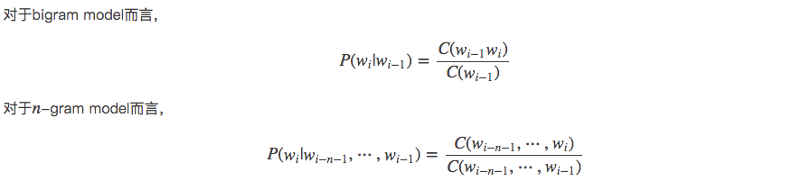
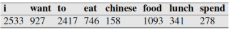
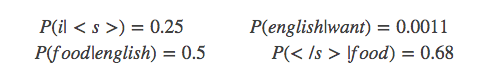
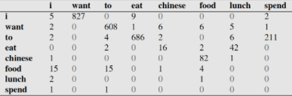
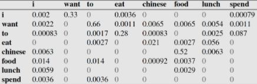
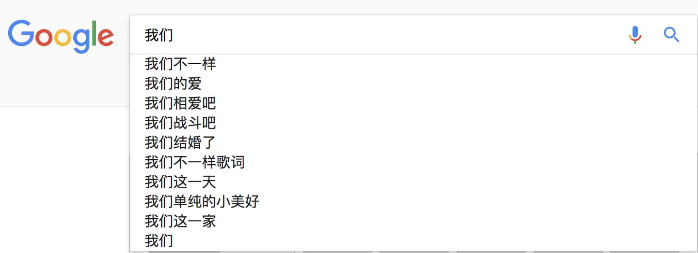
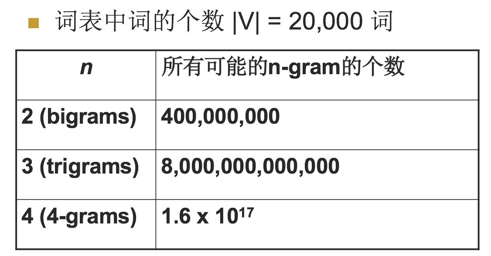

## 一、什么是n-gram模型
N-Gram是一种基于统计语言模型的算法。它的基本思想是将文本里面的内容按照字节进行大小为N的滑动窗口操作，形成了长度是N的字节片段序列。

每一个字节片段称为gram，对所有gram的出现频度进行统计，并且按照事先设定好的阈值进行过滤，形成关键gram列表，也就是这个文本的向量特征空间，列表中的每一种gram就是一个特征向量维度。

该模型基于这样一种假设，第N个词的出现只与前面N-1个词相关，而与其它任何词都不相关，整句的概率就是各个词出现概率的乘积。这些概率可以通过直接从语料中统计N个词同时出现的次数得到。常用的是二元的Bi-Gram和三元的Tri-Gram。

说完了n-gram模型的概念之后，下面讲解n-gram的一般应用。

## 二、n-gram模型用于评估语句是否合理
如果我们有一个由 m 个词组成的序列（或者说一个句子），我们希望算得概率 p(w1,w2,....,wm) ，根据链式规则，可得


这个概率显然并不好算，不妨利用马尔科夫链的假设，即当前这个词仅仅跟前面几个有限的词相关，因此也就不必追溯到最开始的那个词，这样便可以大幅缩减上述算式的长度。即


这个马尔科夫链的假设为什么好用？我想可能是在现实情况中，大家通过真实情况将n=1，2，3，....这些值都试过之后，得到的真实的效果和时间空间的开销权衡之后，发现能够使用。
下面给出一元模型，二元模型，三元模型的定义：

当 n=1, 一个一元模型（unigram model)即为 ：


当 n=2, 一个二元模型（bigram model)即为 ：


当 n=3, 一个三元模型（trigram model)即为


然后下面的思路就很简单了，在给定的训练语料中，利用贝叶斯定理，将上述的条件概率值（因为一个句子出现的概率都转变为右边条件概率值相乘了）都统计计算出来即可。下面会给出具体例子讲解。这里先给出公式：



对第一个进行解释，后面同理,如下：


下面给出具体的例子。


## 三、二元语言模型判断句子是否合理
下面例子来自于：[自然语言处理中的N-Gram模型详解 - 白马负金羁 - CSDN博客](https://blog.csdn.net/baimafujinji/article/details/51281816)和《北京大学 常宝宝 以及 The University of Melbourne “Web Search and Text Analysis” 课程的幻灯片素材》

假设现在有一个语料库，我们统计了下面的一些词出现的数量



下面的这些概率值作为已知条件：


```
p(want|<s>) = 0.25
```
下面这个表给出的是基于Bigram模型进行计数之结果



例如，其中第一行，第二列 表示给定前一个词是 “i” 时，当前词为“want”的情况一共出现了827次。据此，我们便可以算得相应的频率分布表如下。



比如说，我们就以表中的p(eat|i)=0.0036这个概率值讲解，从表一得出“i”一共出现了2533次，而其后出现eat的次数一共有9次，p(eat|i)=p(eat,i)/p(i)=count(i,eat)/count(i)=9/2533 = 0.0036

```
比如说，我们就以表中的p(eat|i)=0.0036这个概率值讲解，从表一得出“i”一共出现了2533次，而其后出现eat的次数一共有9次，p(eat|i)=p(eat,i)/p(i)=count(i,eat)/count(i)=9/2533 = 0.0036

下面我们通过基于这个语料库来判断s1=“<s> i want english food</s>” 与s2 = "<s> want i english food</s>"哪个句子更合理：通过例子来讲解是最人性化的，我在网上找了这么久发现这个例子最好：

首先来判断p(s1)

P(s1)=P(i|<s>)P(want|i)P(english|want)P(food|english)P(</s>|food)

=0.25×0.33×0.0011×0.5×0.68=0.000031

再来求p(s2)？

P(s2)=P(want|<s>)P(i|want)P(english|want)P(food|english)P(</s>|food)

=0.25*0.0022*0.0011*0.5*0.68 = 0.00000002057
```

### 通过比较我们可以明显发现0.00000002057<0.000031,也就是说s1= "i want english food</s>"更像人话。
    
### 再深层次的分析，我们可以看到这两个句子的概率的不同，主要是由于顺序i want还是want i的问题，根据我们的直觉和常用搭配语法，i want要比want i出现的几率要大很多。所以两者的差异，第一个概率大，第二个概率小，也就能说的通了。
    
### 下面再给出生活中常用的一个应用。

## 四、N-gram模型的一个常见应用

搜索引擎（Google或者Baidu）、或者输入法的猜想或者提示。你在用谷歌时，输入一个或几个词，搜索框通常会以下拉菜单的形式给出几个像下图一样的备选，这些备选其实是在猜想你想要搜索的那个词串。

再者，当你用输入法输入一个汉字的时候，输入法通常可以联系出一个完整的词，例如我输入一个“刘”字，通常输入法会提示我是否要输入的是“刘备”。通过上面的介绍，你应该能够很敏锐的发觉，这其实是以N-Gram模型为基础来实现的。比如下图：



那么原理是什么呢？也就是我打入“我们”的时候，后面的“不一样”，”的爱“这些是怎么出来的，怎么排序的？

实际上是根据语言模型得出。假如使用的是二元语言模型预测下一个单词：

排序的过程就是：

p(”不一样“|"我们")>p(”的爱“|"我们")>p(”相爱吧“|"我们")>.......>p("这一家"|”我们“)，这些概率值的求法和上面提到的完全一样，数据的来源可以是用户搜索的log。


## 五、n-gram的n大小对性能的影响
### 1. n更大的时候

   n: 对下一个词出现的约束性信息更多，更大的辨别力，但是更稀疏，并且n-gram的总数也更多，为 [公式] 个（V为词汇表的大小）

### 2. n更小的时候
   在训练语料库中出现的次数更多，更可靠的统计结果，更高的可靠性 ，但是约束信息更少

其中当N为特定值的时候，我们来看一下n-gram可能的总数，如下表：



对于上图，我用一个例子来进行解释，加入目前词汇表中就只有三个单词，”我爱你“，那么bigram的总数是3^2=9个，有”我我“，我爱，我你，爱爱，爱你，爱我，你你，你我，你爱这9个,所以对应上面的表示是bigrams是20000^2=400000000,trigrams=20000^3 = 8*10e12

好，到这里讲解了n-gram的基本内容了。

转载于 [自然语言处理中N-Gram模型介绍](https://zhuanlan.zhihu.com/p/32829048)


