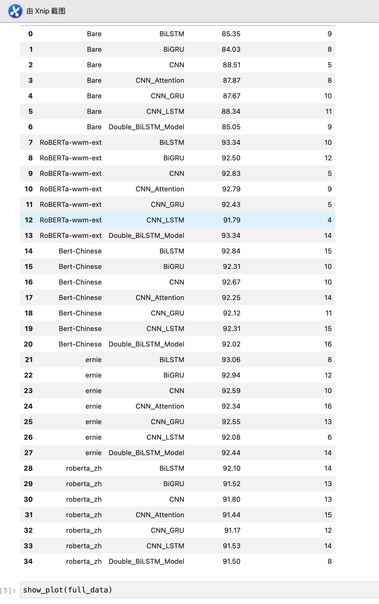
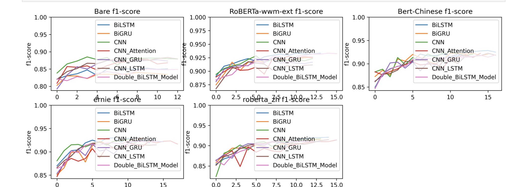

## 实现思路
### 现有的实现方案
|  基于词典   | 基于深度学习  |
|  ----  | ----  |
| 依赖于情感词典，无需标注  | 依赖大量的人工标注 |
| 依赖代码规则  | 依赖模型训练 |
| 准确率低  | 准确率高 |
| 响应时间快  | 不同模型时延不同 |
| 无需GPU  | 需要GPU |
| 对新出现的词，依赖词典更新，人工维护  | 对未出现的用语，依赖人工标注新数据 |


### 做的尝试
在此感谢[huggingface](huggingface.co/huawei-noah)提供的各种预训练模型，基于相同的数据下有如下比对结果


在不使用预训练模型的时候，效果最好的是CNN模型，在经过5轮epoch之后在验证集上F1值能达到88.51	，而加入预训练模型之后，最低也在91之上。可见transformer的预训练模型确实厉害。
本以为效果最好的就是bert+cnn的模型了，此时看到苏神的一篇文章[当Bert遇上Keras：这可能是Bert最简单的打开姿势](https://spaces.ac.cn/archives/6736)中的一句话
```
是“有什么原则来指导Bert后面应该要接哪些层？”。
答案是：用尽可能少的层来完成你的任务。
比如上述情感分析只是一个二分类任务，
你就取出第一个向量然后加个Dense(1)就好了，
不要想着多加几层Dense，更加不要想着接个LSTM再接Dense；
如果你要做序列标注（比如NER），
那你就接个Dense+CRF就好，也不要多加其他东西。
总之，额外加的东西尽可能少。
一是因为Bert本身就足够复杂，它有足够能力应对你要做的很多任务；
二来你自己加的层都是随机初始化的，加太多会对Bert的预训练权重造成剧烈扰动，
容易降低效果甚至造成模型不收敛～

```
这是之前没有考虑到的，于是简单的用bert后面接一个liner层之后再做训练，模型效果提升有3个百分点。
这里查资料说可能是因为bert和cnn ，lstm等都是用于提取特征的，而bert本身提取的特征效果已经很好了，在bert之后再套用cnn等于将捕捉特征又弱化(降噪过程会导致特征丢失)。

## bert 带来的问题
- 计算量大，模型太重，响应时间长

## 解决方案
- [模型蒸馏](https://github.com/huawei-noah/Pretrained-Language-Model/tree/master/TinyBERT)
- [模型加速推理部署](https://gitmemory.cn/repo/huggingface/awesome-huggingface#%EF%B8%8F-inference-engines)
  1. TurboTransformers (from Tencent)
  2. FasterTransformer (from Nvidia) 
  3. lightseq (from ByteDance
  4. FastSeq (from Microsoft) 
  
- 模型量化
  1. fp16 精度量化（依赖特定GPU）
  2. int8 精度量化

## 后续计划
- 推理部署的尝试 fastTransformers,tritionserver
- 词典结合模型，做到流程闭环
- 增量数据训练


-- bert
-- 蒸馏
-- 量化
-- 部署
