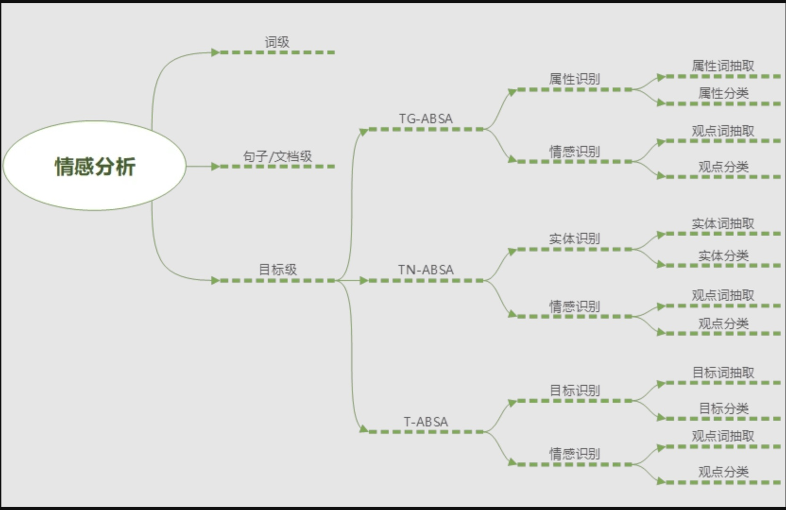
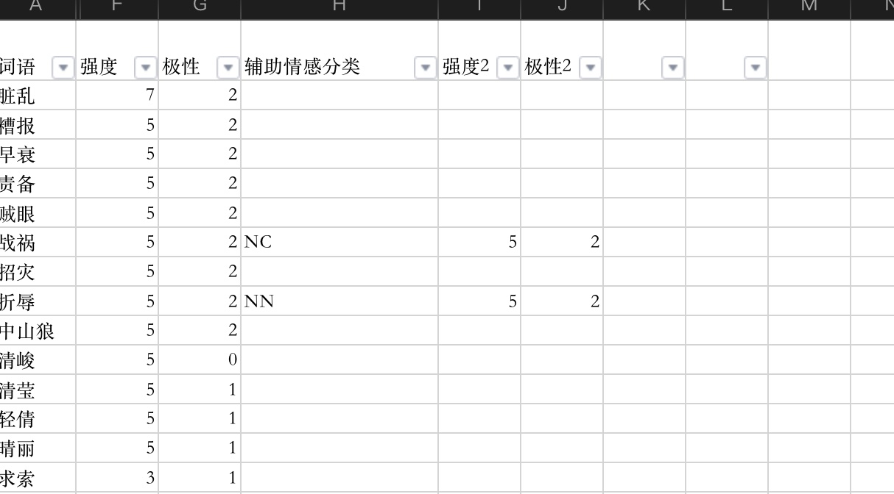
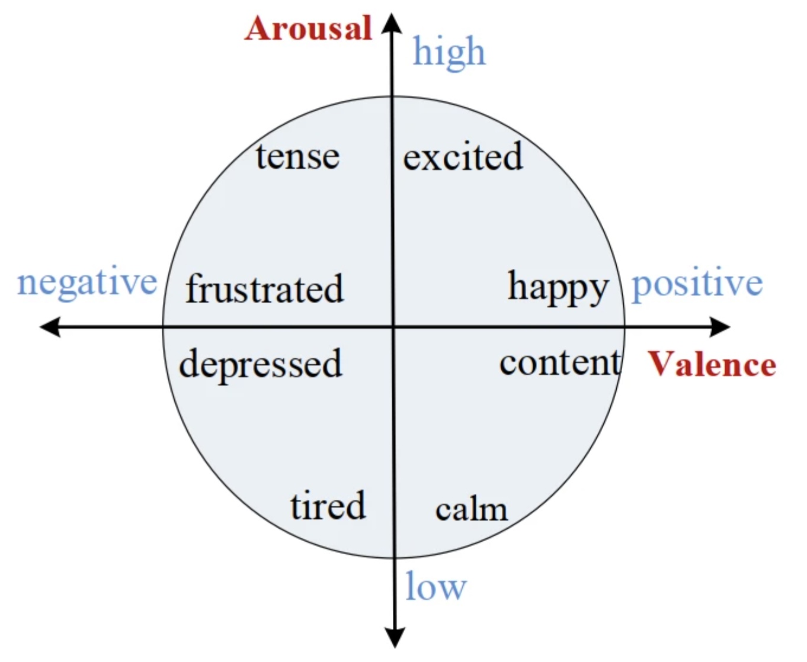
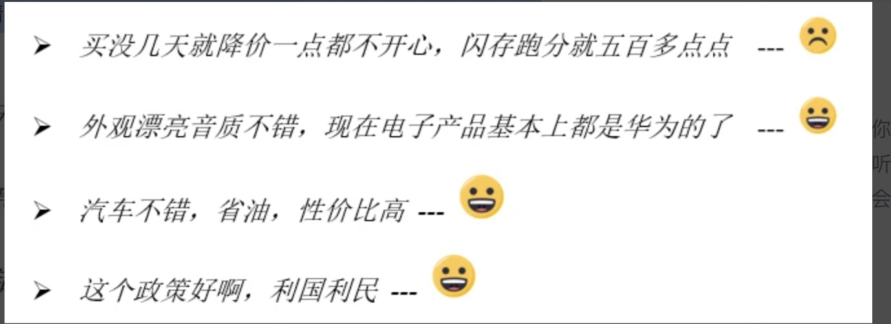
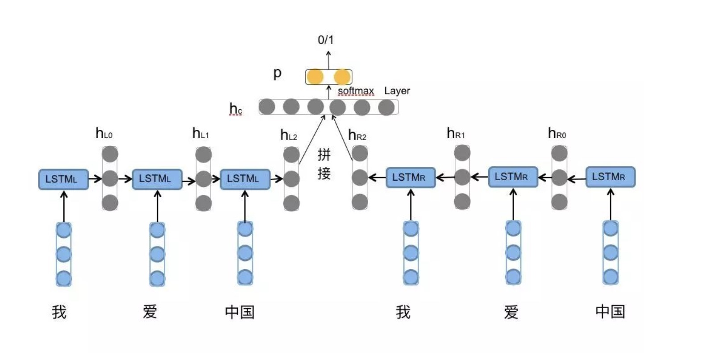

## 1、基本概念
为什么：随着移动互联网的普及，网民已经习惯于在网络上表达意见和建议，比如电商网站上对商品的评价、社交媒体中对品牌、产品、政策的评价等等。这些评价中都蕴含着巨大的商业价值。比如某品牌公司可以分析社交媒体上广大民众对该品牌的评价，如果负面评价忽然增多，就可以快速采取相应的行动。而这种正负面评价的分析就是情感分析的主要应用场景。

是什么：文本情感分析旨在分析出文本中针对某个对象的评价的正负面，比如“华为手机非常好”就是一个正面评价。情感分析主要有五个要素，（entity/实体，aspect/属性，opinion/观点，holder/观点持有者，time/时间），其中实体和属性合并称为评价对象(target)。情感分析的目标就是从非结构化的文本评论中抽取出这五个要素。

## 2、任务分类
当前情感分析的主要任务包括
- 词级别情感分析
- 句子/文档级情感分析
- 目标级情感分析




## 3、业界一般做法

### 3.1、词级别的情感分析
词级别的情感分析，即构建情感词典（sentiment lexicon），旨在给词赋予情感信息。离散表示法如情感分析领域常用的{正面，负面，中性}的表示方法，或者如表

用离散表示法表示的情感词典如：
```高兴-正面，生日-正面，车祸-负面，灾难-负面```

多维度表示法也有多种，如 Valence-Arousal-Dominance（VAD）模型，Evaluation-Potency-Activity（EPA）模型等。Valence 和 Evaluation 表示好坏，arousal 和 activity 表示人的唤起度，dominance 和 potency 表示控制力。

用连续多维表示方法的情感词典例子如：
```
VAD 模型在[1,9]取值范围下：车祸可表示为 (2.05, 6.26, 3.76)

```
#### 参考
- [情感词下载地址](https://mlln.cn/2018/10/11/%E4%B8%AD%E6%96%87%E6%83%85%E6%84%9F%E5%88%86%E6%9E%90%E8%AF%AD%E6%96%99%E5%BA%93%E5%A4%A7%E5%85%A8-%E5%B8%A6%E4%B8%8B%E8%BD%BD%E5%9C%B0%E5%9D%80/)
- [基于情感词典的情绪分析](https://www.zybuluo.com/evilking/note/1012623)


### 3.2、句子级别/篇章级别的情感分析
句子级和篇章级文本情感分析旨在整个句子或文章表达的情感倾向性，如下例子：

句子级情感分析是一个典型的文本分类任务,近几年基于深度学习的BiLSTM+Attention模型取得了不错的效果。
LSTM的全称是Long Short-Term Memory，它是RNN（Recurrent Neural Network）的一种。LSTM由于其设计的特点，非常适合用于对时序数据的建模，如文本数据。BiLSTM是Bi-directional Long Short-Term Memory的缩写，是由前向LSTM与后向LSTM组合而成。两者在自然语言处理任务中都常被用来建模上下文信息。



#### 参考 
- [详解BiLSTM及代码实现](https://zhuanlan.zhihu.com/p/47802053)
- [百度开源Senta](https://gitee.com/baidu/Senta#https://github.com/qweraqq/NLPCC2014_sentiment)
- [bert4keras](https://github.com/bojone/bert4keras/tree/master/examples)

### 3.3、目标级别文本情感分析

该例子对汽车的各个属性的评价正负面是不一样的，如对动力和外观来说是正面，对空间和油耗来说是负面，所以就不能简单的分析整体文本的正负面。需要对汽车的不同属性给出不同的情感倾向分析结果


#### 参考
- [LC-ABSA](https://github.com/yangheng95/PyABSA/tree/LC-ABSA)
- [细粒度情感分析任务（ABSA）的最新进展](https://www.sohu.com/a/364481128_500659)
- [情感分析-ABSA模型](https://www.jianshu.com/p/6ef09dcab56e)
- [NLP系列之论文研读：细粒度的情感分析（ABSA）](https://zhuanlan.zhihu.com/p/397363963)

## 4 当前遇到的问题
- 不同领域（如餐饮、体育）的情感表达方式各不相同，即便是同一场景的表达也极其复杂，很难用一个模型取覆盖所有的领域场景
- 自然语言的时代性，如当前的网络新语言 yyds awsl，如果模型没有相关的数据或者经验，就很难分辨
- 中文表达的多样性，如反讽，隐喻等等，有的时候人都不一定能分辨
- 优质训练数据的缺少，在模型训练中，数据的质量决定了模型质量的上限，而算法只能取逼近这个上限
- 需求不明，当前尚不清楚测评的具体需求，如：
   1. 测评的情感分析分几类，是否涉及多情感分类，还是只分正负极性分类
   2. 测评的具体要求是怎样，是否设计目标级别情感分类
   3. 是否有具体的测评领域，是否会提供训练数据，当前尚不能做到一个模型适用于不同的领域，不同领域的情感分析对模型的结果影响比较大

## 应对方案
1. 当前尚不明确评测的应用领域范围，我们尽可能搜集多领域方面的开源数据集训练基础模型，后期如果评测方能够提供测试集，再在此基础上做迁移训练
2. 必要的时候从微博或电商网站爬取评论数据，清洗之后找标注团队标注
3. 借鉴业界成熟的论文和模型训练，作超参调试，比较效果
4. 当前分两个方向，在做好 词，句子/篇章 级别的情感分析的基础上，研究目标级别的情感倾向分析


