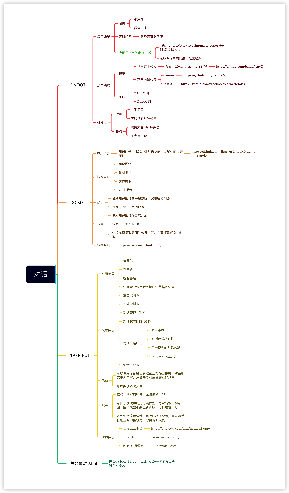

### 先放一张思维导图


### QA BOT
先说QA类型的机器人，这类聊天机器人的应用场景包括:
- 闲聊机器人（小爱同学，微软小冰，天猫精灵，小黄鸡）
- 客服问答（基于知识库的智能问答），各大电商的机器人客服大多数是这类

QA类型的机器人实现方式又包括两种，即：
- 检索式，基于搜索引擎（solar，es）或者向量检索（annoy,faiss）➕ [文本相似度比较](work/nlp/相似度计算.md)➕排序召回，这种实现方式的优点是：返回结果可控，不会出现训练数据之外的结果，更适合客服等需要明确答复的。缺点是，结果的确定性导致的每次返回结果都一样，作为闲聊机器人缺少趣味性。比较好的实现是百度的anyq框架，可以参考它的实现架构
- 生成式，基于GPT等seq2seq的生成式模型。这种实现方式的结果不确定，效果也相对不可控，目前开源的实现就是[GPT](https://github.com/thu-coai/CDial-GPT)了

目前，检索式的机器人只支持一问一答，生成式的聊天机器人则可以支持训练多轮问答（实现方式是在训练的时候将前几轮的输入和输出当作模型输入进训练，实际上是一种变相的单论变多轮）。


### KG BOT (知识图谱问答)
图谱的问答，借助知识图谱海量的数据，和数据之间的关系，解决了单纯QA类型闲聊相对弱智的问题。他可以像一本百科书一样回答你想知道的一些问题

在了解什么是知识图谱问答之前，先了解什么是知识图谱。
```
通俗地讲，知识图谱就是把所有不同种类的信息（Heterogeneous Information）连接在一起而得到的一个关系网络。
知识图谱这个网络具备以下3种特性：
1.1 由节点(Point)和边(Edge)组成
1.2 每个节点表示现实世界中存在的“实体”，每条边为实体与实体之间的“关系”
1.3 知识图谱是关系的最有效的表示方式

知识图谱本质上就是语义网络，是一种基于图的数据结构；和传统的mysql ，mongodb 相同的是，他们都是一种数据存储的方式。
```

> 那么如何借助知识图谱进行问答呢？

知识图谱本质上可以理解为一种数据库，我们可以用查询语句进行知识的查询。那么如何将自然语言转换成知识图谱的查询语句，就是我们要做的事情。这里以neo4j进行距离。

比如 我们想问 **姚明的老婆是谁**，那么首先我们要从这句话中抽取出 **姚明** 识别到这是一个人名，抽取出 **老婆** 这是一个关系名，那么就一个得到查询语句
```
MATCH (a:实体) ,(b:实体),(a)-[r:老婆]->(b) WHERE a.value = '姚明' return b.value;
```

至于如何把把一句话专变成查询语句，方式基本分为两种
1. 基于模板配置的方式，一个模板对应一个查询语句或多个查询语句 参考[医疗知识图谱问答](https://github.com/zhihao-chen/QASystemOnMedicalGraph)
2. 基于实体识别和实体关系抽取得到实体和关系参考[kgClue](https://github.com/CLUEbenchmark/KgCLUE)

>基于知识图谱问答目前比较难得一个问题就是如何解决多跳的问题，如”姚明老婆的生日“ ，“姚明老婆妹妹的生日” 这种二跳甚至三跳的问题。


### 参考
- [ 一文读懂知识图谱（初学篇）](https://zhuanlan.zhihu.com/p/37057052)
- [anyq](https://github.com/baidu/AnyQ)

### Task Bot 任务型问答
顾名思义，就是基于某个特定任务的问答机器人，可以实现比如查天气，查机票，订酒店等基于某个特定任务的问答

- 