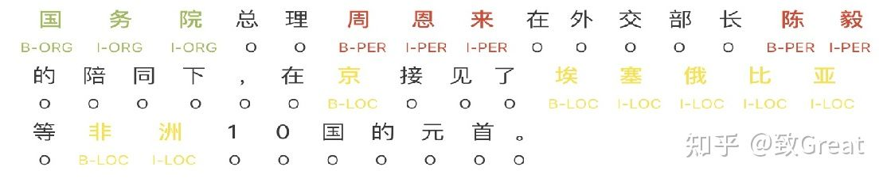
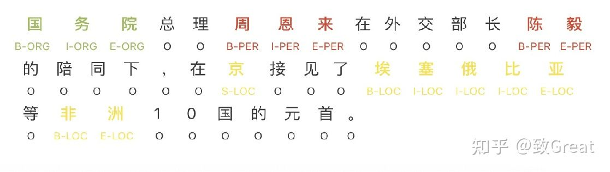
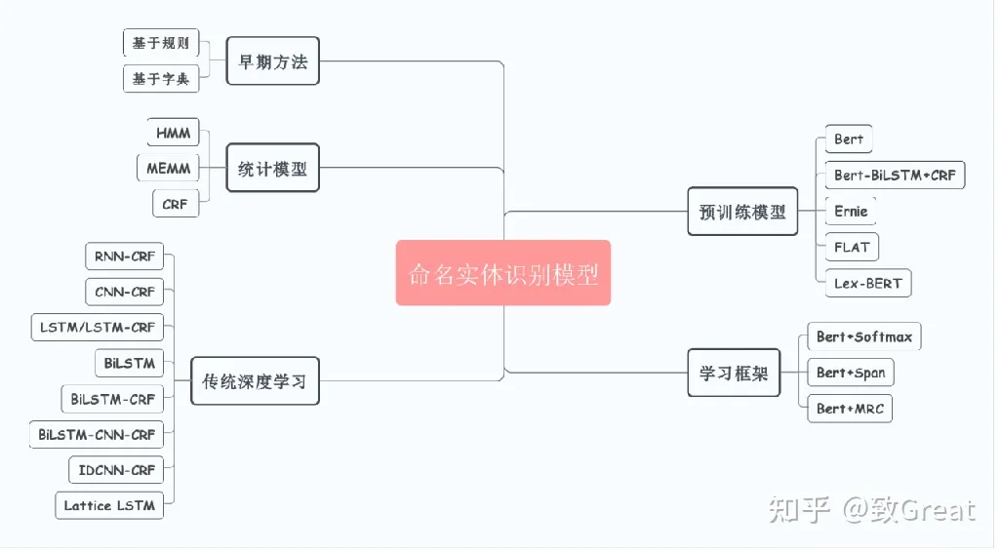

### 任务描述

**命名实体识别**（英语：Named Entity Recognition），简称**NER**，是指识别文本中具有特定意义的实体，主要包括人名、地名、机构名、专有名词等，以及时间、数量、货币、比例数值等文字。

举个例子，假如有这么一句话：

> ACM宣布，深度学习的三位创造者Yoshua Bengio， Yann LeCun， 以及Geoffrey Hinton获得了2019年的图灵奖。

那么NER的任务就是从这句话中提取出

-   机构名：ACM
-   人名：Yoshua Bengio， Yann LeCun，Geoffrey Hinton
-   时间：2019年
-   专有名词：图灵奖


### 标注数据格式
标签类型的定义一般如下：
|定义|全称|备注|
|--|--|--|
|B|Begin|实体片段的开始|
|I|Intermediate|实体片段的中间|
|E|End|实体片段的结束|
|S|Single|单个字的实体|
|O|Other/Outside|其他不属于任何实体的字符(包括标点等)

### BIO标注模式
将每个元素标注为“B-X”、“I-X”或者“O”。其中，“B-X”表示此元素所在的片段属于X类型并且此元素在此片段的开头，“I-X”表示此元素所在的片段属于X类型并且此元素在此片段的中间位置，“O”表示不属于任何类型。

命名实体识别中每个token对应的标签集合如下:
```text
LabelSet = {O, B-PER, I-PER, B-LOC, I-LOC, B-ORG, I-ORG}
```

  

### BIOES 标注模式
BIOES标注模式就是在BIO的基础上增加了单字符实体和字符实体的结束标识, 即
```text
LabelSet = {O, B-PER, I-PER, E-PER, S-PER, B-LOC, I-LOC, E-LOC, S-LOC, B-ORG, I-ORG, E-ORG, S-ORG}
```

  

### 实体识别公开数据集
- [CLUENER2020](https://github.com/GuocaiL/nlp_corpus/tree/main/open_ner_data/cluener_public)
- [MSRA](https://github.com/GuocaiL/nlp_corpus/tree/main/open_ner_data/MSRA)
- [人民网](https://github.com/GuocaiL/nlp_corpus/tree/main/open_ner_data/people_daily)
- [微博命名实体识别数据集](https://github.com/GuocaiL/nlp_corpus/tree/main/open_ner_data/weibo)
- [BosonNLP NER数据](https://github.com/GuocaiL/nlp_corpus/tree/main/open_ner_data/boson)
- [影视-音乐-书籍实体标注数据](https://github.com/GuocaiL/nlp_corpus/tree/main/open_ner_data/video_music_book_datasets)
- [中文医学文本命名实体识别](https://github.com/GuocaiL/nlp_corpus/tree/main/open_ner_data/2020_ccks_ner)
- [电子简历实体识别数据集](https://github.com/GuocaiL/nlp_corpus/tree/main/open_ner_data/ResumeNER)
- [医渡云实体识别数据集](https://github.com/GuocaiL/nlp_corpus/tree/main/open_ner_data/yidu-s4k)
- [简历实体数据集](https://github.com/jiesutd/LatticeLSTM/tree/master/data)
- [CoNLL-2003](https://www.clips.uantwerpen.be/conll2003/ner/)
- [Few-NERD 细粒度数据集](https://github.com/thunlp/Few-NERD/tree/main/data)


### 命名实体识别模型


### 实现工具
1. [Hanlp](https://github.com/hankcs/pyhanlp)  官网：http://hanlp.linrunsoft.com/
2. [bert4keras](https://github.com/bojone/bert4keras/blob/master/examples/task_sequence_labeling_ner_crf.py)  苏剑林大神维护的开源工具，提供了包括实体识别，关系抽取，文本分类，文本生成等一系列nlp任务的实现


### 参考
- [NLP实战-中文命名实体识别](https://zhuanlan.zhihu.com/p/61227299)
- 