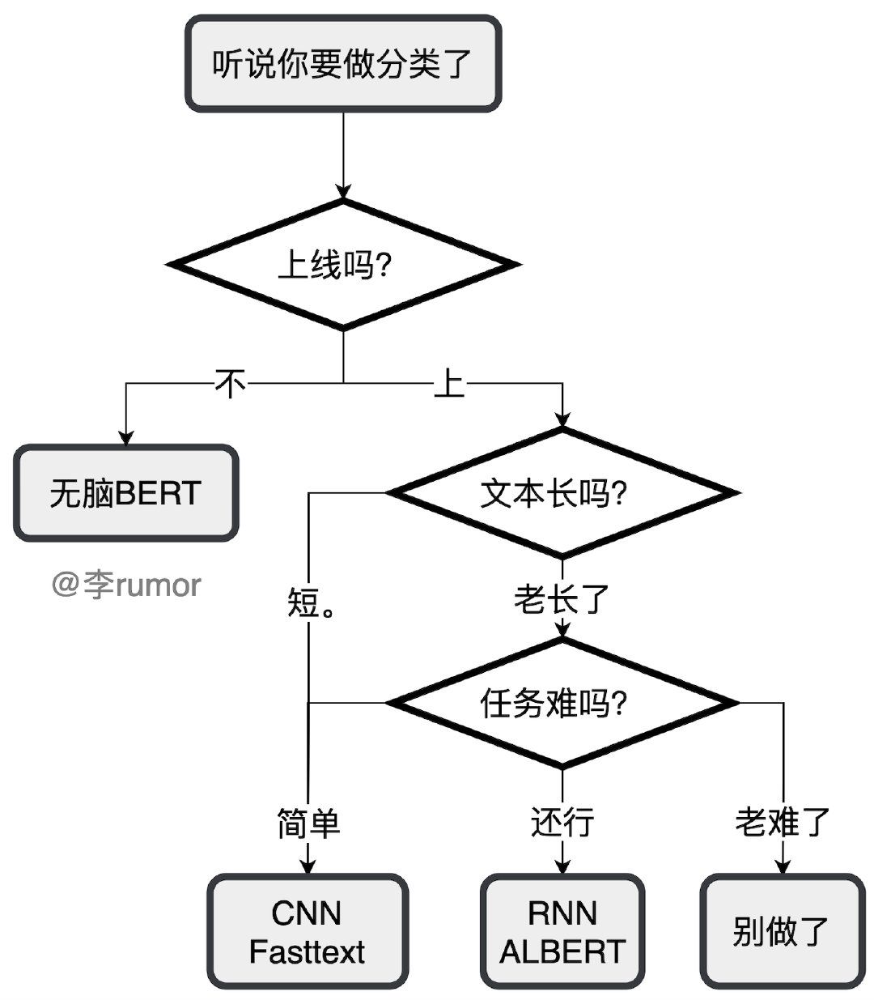
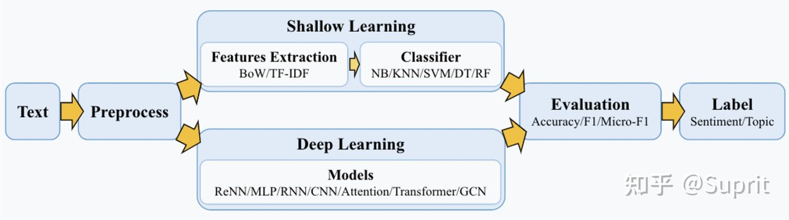

### 简介
文本分类（Text Classification 或 Text Categorization，TC），又称自动文本分类（Automatic Text Categorization），是指**计算机将载有信息的一篇文本映射到预先给定的某一类别或某几类别主题的过程**，实现这一过程的算法模型叫做**分类器**。文本分类问题算是自然语言处理领域中一个非常经典的问题。

根据预定义的类别不同，文本分类分两种：**二分类**和**多分类**，多分类可以通过二分类来实现。  
从文本的标注类别上来讲，文本分类又可以分为**单标签**和**多标签**，因为很多文本同时可以关联到多个类别。

### 应用场景
-   情感分析：sentiment analysis ( SA)
-   话题标记：topic labeling(TL)
-   新闻分类：news classification (NC)
-   问答系统：question answering(QA)
-   对话行为分类：dialog act classification (DAC)
-   自然语言推理：natural language inference (NLD),
-   关系分类：relation classification (RC)
-   事件预测：event prediction (EP)

### 实现方式
先放一张图😄

文本分词的一般实现方式如下图

1. 文本预处理：包括特殊字符处理，大小写处理，文本长度处理。[文本分词](work/nlp/文本分词.md),停用词处理等
2.  机器学习模型 特征提取（[BOW词袋模型](work/nlp/n-gram.md)/ TF-IDF）➕ 分类器（NB/KNN/SVM/DT/RF 等）
      深度学习模型：ReNN/MLP/RNN/CNN/Attention/Transformer/GCN 等
3.  模型评估 acc/F1

### 基于Bert的文本分类实现方式
- [google bert 源码](https://github.com/google-research/bert)
- [transformers](https://github.com/huggingface/transformers/tree/main/examples/pytorch/text-classification)  代码实现z参考github 的 Readme

### 参考
- [自然语言处理—文本分类综述【万字长文】](https://zhuanlan.zhihu.com/p/436429409)
- [transformer模型仓库](https://huggingface.co/models)

