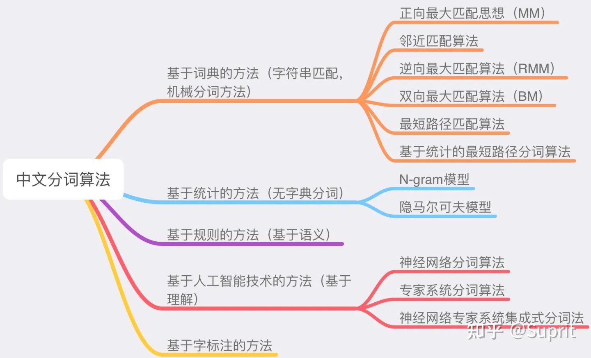

## 什么是文本分词
先来看看维基百科上分词的定义：Word segmentation is the problem of dividing a string of written language into its component words.
中文分词(Chinese Word Segmentation)指的是将一个汉字序列切分成一个个单独的词。分词就是将连续的字序列按照一定的规范重新组合成词序列的过程。
简单的讲，中文分词就是让计算机系统在汉语文本中的词与词之间自动加上空格或其他边界标记。
### 为什么需要文本分词

中文分词是中文文本处理的一个基础步骤，也是中文人机自然语言交互的基础模块。不同于英文的是，中文句子中没有词的界限，因此在进行中文自然语言处理时，通常需要先进行分词，分词效果将直接影响词性、句法树等模块的效果


### 汉语分词的难点
汉语分词是自然语言处理中一个重要的基础研究任务，其主要难点包括分词规范、歧义切分、未登录词识别等。
- 分词规范   词这个概念一直是汉语语言学界纠缠不清又挥之不去的问题，也就是说，对于词的抽象定义(词是什么)和词的具体界定(什么是词)迄今拿不出一个公认的、具有权威性的词表来。
- 歧义切分  切分歧义是汉语分词研究中一个大问题，因为歧义字段在汉语文本中大量存在。处理这类问题可能需要进行复杂的上下文语义分析，甚至韵律分析(语气、重音、停顿等)。  
- 未登录词识别  未登录词又叫生词，一般有二种解释：第一种指的是已有的词表中没有收录的词；第二种指的是已有的训练语料中未曾出现过的词。在第二种解释下，又称之为集外词(out of vocabulary，OOV)。

### 分词基本方法
- 基于词典的分词方法(机械分词) 
  这种方法本质上就是字符串匹配的方法，将一串文本中的文字片段和已有的词典进行匹配，如果匹配到，则此文字片段就作为一个分词结果。但是基于词典的机械切分会遇到多种问题，最为常见的包括歧义切分问题和未登录词问题。

  常用的字符串匹配方法包括：正向最大匹配法（从左到右的方向）；逆向最大匹配法（从右到左的方向）；最小切分（每一句中切出的词数最小）双向最大匹配（进行从左到右、从右到左两次扫描）。
  
  这类算法的优点是速度快，时间复杂度可以保持在O（n）,实现简单，效果尚可，但是对歧义和未登录词处理效果不佳。

- 基于统计的分词方法
  基于统计的分词方法是在给定大量已经分词的文本的前提下，利用统计机器学习模型学习词语切分的规律（称为训练），从而实现对未知文本的切分。例如最大概率分词方法和最大熵分词方法等。随着大规模语料库的建立，统计机器学习方法的研究和发展，基于统计的中文分词方法渐渐成为了主流方法。

  主要的统计模型有：N元文法模型（N-gram），隐马尔可夫模型（Hidden Markov Model ，HMM），最大熵模型（ME），条件随机场模型（Conditional Random Fields，CRF）等。

  基于统计的分词方法包括：N-最短路径方法、基于词的n元语法模型的分词方法、由字构词的汉语分词方法、基于词感知机算法的汉语分词方法、基于字的生成式模型和区分式模型相结合的汉语分词方法。

- 基于深度学习的分词方法

  近几年，深度学习方法为分词技术带来了新的思路，直接以最基本的向量化原子特征作为输入，经过多层非线性变换，输出层就可以很好的预测当前字的标记或下一个动作。在深度学习的框架下，仍然可以采用基于子序列标注的方式，或基于转移的方式，以及半马尔科夫条件随机场。

  这类方法首先对语料的字进行嵌入，得到字嵌入后，将字嵌入特征输入给双向LSTM，输出层输出深度学习所学习到的特征，并输入给CRF层，得到最终模型。现有的方法包括：LSTM+CRF、BiLSTM+CRF等。

-  基于理解的分词方法 

  基于理解的分词方法是通过让计算机模拟人对句子的理解，达到识别词的效果。其基本思想就是在分词的同时进行句法、语义分析，利用句法信息和语义信息来处理歧义现象。

  它通常包括三个部分：分词子系统、句法语义子系统、总控部分。在总控部分的协调下，分词子系统可以获得有关词、句子等的句法和语义信息来对分词歧义进行判断，即它模拟了人对句子的理解过程。

  这种分词方法需要使用大量的语言知识和信息。由于汉语语言知识的笼统、复杂性，难以将各种语言信息组织成机器可直接读取的形式，因此目前基于理解的分词系统还处在试验阶段。



### 文本分词工具
- [jieba](https://github.com/fxsjy/jieba)
```
# 安装：pip install jieba  
# 国内源安装更快：pip install jieba -i https://pypi.tuna.tsinghua.edu.cn/simple  
import jieba  
  
# 全模式分词  
wordseg_all = jieba.cut("我爱自然语言处理技术！", cut_all=True)  
print("全模式: " + " ".join(wordseg_all))  
# 输出：全模式: 我 爱 自然 自然语言 语言 处理 技术   
  
# 精确模式分词  
wordseg = jieba.cut("我爱自然语言处理技术！", cut_all=False)  
print("精确模式: " + " ".join(wordseg))  
# 输出：精确模式: 我 爱 自然语言 处理 技术 ！  
  
# 搜索引擎模式  
wordseg_search = jieba.cut_for_search("我爱自然语言处理技术！")    
print("搜索引擎模式:" + " ".join(wordseg_search))  
# 输出：搜索引擎模式:我 爱 自然 语言 自然语言 处理 技术 ！
```
- [hanlp](https://github.com/hankcs/pyhanlp)
```
# 安装：pip install pyhanlp  
# 国内源安装：pip install pyhanlp  -i https://pypi.tuna.tsinghua.edu.cn/simple  
from pyhanlp import *  
  
s = '我爱自然语言处理技术！'  
word_seg = HanLP.segment(s)  
for term in word_seg:  
   print(term.word)
```
- [snownlp](https://github.com/isnowfy/snownlp)
```
# 安装：pip install snownlp  
# 国内源安装：pip install snownlp  -i https://pypi.tuna.tsinghua.edu.cn/simple  
from snownlp import SnowNLP  
model = SnowNLP(u'我爱自然语言处理技术！')  
print(model.words)  
  
#　输出：['我', '爱', '自然', '语言', '处理', '技术', '！']
```
- pkuseg
- [thulac](https://github.com/thunlp/THULAC)
```
# 安装：pip install thulac  
# 国内源安装：pip install thulac     -i https://pypi.tuna.tsinghua.edu.cn/simple  
import thulac  
# 默认模式：分词的同时进行词性标注  
thulac_model = thulac.thulac()  
wordseg = thulac_model.cut("我爱自然语言处理技术！")  
print(wordseg)  
  
# 输出：[['我', 'r'], ['爱', 'v'], ['自然', 'n'], ['语言', 'n'], ['处理', 'v'], ['技术', 'n'], ['！', 'w']]  
  
# 只进行分词  
seg_only_model = thulac.thulac(seg_only=True)  
wordseg_only = seg_only_model.cut("我爱自然语言处理技术！")  
print(wordseg_only)  
  
# 输出：[['我', ''], ['爱', ''], ['自然', ''], ['语言', ''], ['处理', ''], ['技术', ''], ['！', '']]
```


### 参考
- [NLP文本分词](https://zhuanlan.zhihu.com/p/41036343)
- [一文读懂文本分词](https://mp.weixin.qq.com/s?__biz=MzA3OTI3MjEzNg==&mid=2650874045&idx=2&sn=0060a1c91248add86be90f593866dc89&chksm=8443811ab334080c9ae4a072f2118ae41cdeb2ec351bfae19c3c86cef56436535ee80e88650e&scene=27)
