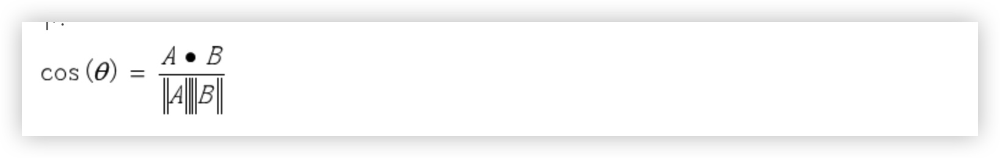

### 如何比较两句话的相似度
-  编辑距离
- 杰卡德系数计算
- 余弦相似度
- simnet 模型

### 编辑距离
编辑距离（Edit Distance），又称Levenshtein距离，是指两个字串之间，由一个转成另一个所需的最少编辑操作次数。编辑操作包括将一个字符替换成另一个字符，插入一个字符，删除一个字符。一般来说，编辑距离越小，两个串的相似度越大。
```
例如将kitten一字转成sitting：（'kitten' 和 ‘sitting' 的编辑距离为3）  

sitten （k→s）  

sittin （e→i）  

sitting （→g）
```
### 杰卡德(Jaccard)系数计算
```
计算公式 A交B/A并B
例如  clone 和  alone 相似度
len('lone')/len('calone')=4/6
```
### 余弦相似度
余弦相似度，是通过计算两个向量的夹角余弦值来评估向量间的相似度。将向量根据坐标映射到向量空间。求得他们的夹角，并得出夹角对应的余弦值，余弦值就可以用来表示这两个向量的相似性。  
夹角越小，余弦值越接近于1，它们的方向更加吻合，则越相似。两个向量A,B之间的余弦相似度计算公式如下：

其中A 和 B 是文本的特征向量，可以基于 [n-gram](#n-gram.md)  或是bert生成

###  simnet 模型
基于分类模型实现的相似度计算模型，训练数据为一对一对的文本pair对，标签为0（不相似） 和1 （相似），参考百度paddle 的simnet模型
```
柏格曼 橱柜 有 吗	除了 橱柜 ， 其他 可以 定制 吗 ？	0

皮 表带 断了 能 修 吗 ？	扣 表带 的 地方 断了 ， 能 修 吗 ？	1

你好 、 请问 你们 有 实木 橱柜 门板 批发 吗 ？	除了 橱柜 ， 其他 可以 定制 吗 ？	0

手表 不动 了 怎么 办	手表 不走 了 怎么 办 ？	1

个体 营业执照 代办	你们 这 可以 办理 营业执照 吗	1
```


### 参考
- [Python计算余弦相似性](https://zhuanlan.zhihu.com/p/508625294)
- [七种文本相似度计算方式](https://blog.csdn.net/qq_41853758/article/details/82750292?ops_request_misc=&request_id=&biz_id=102&utm_term=文本相似度算法&utm_medium=distribute.pc_search_result.none-task-blog-2~all~sobaiduweb~default-8-82750292.nonecase&spm=1018.2226.3001.4187)
-  [simnet 模型](https://aistudio.baidu.com/aistudio/projectdetail/124373)
- [Levenshtein工具包](https://zhuanlan.zhihu.com/p/441461943)
